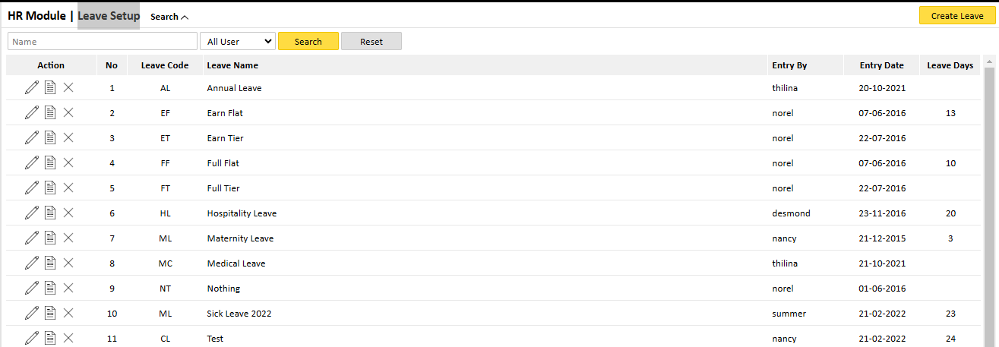
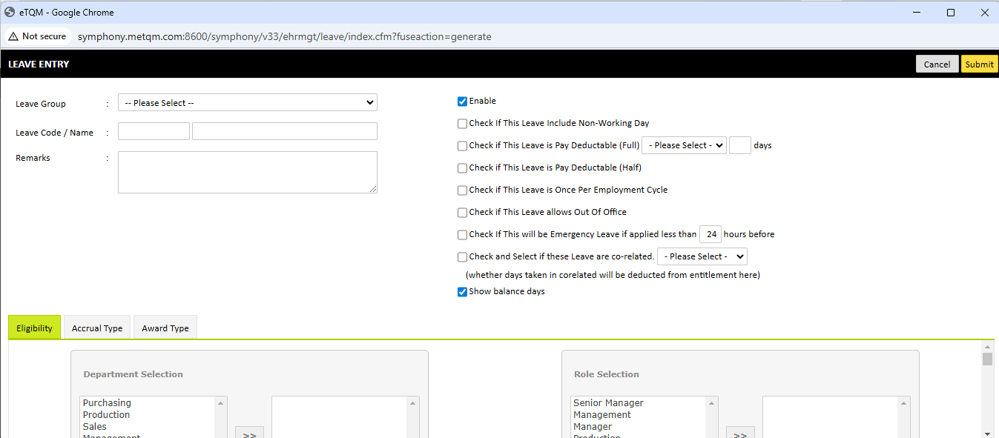
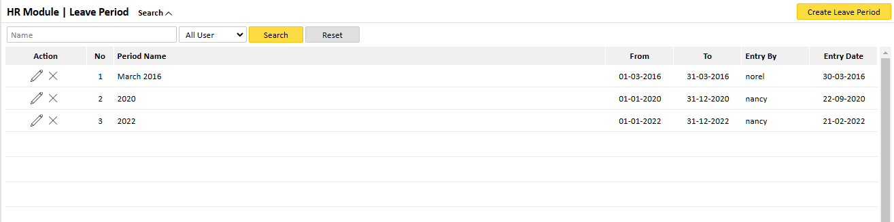
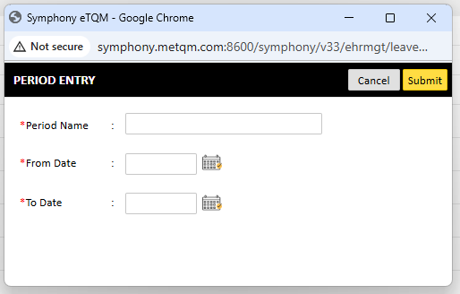

Before using Symphony eHRM, initial configurations are required. This includes setting up master files such as leave types and employee records.

### 1.1 Leave Type Setup

To configure leave types:

    1. Navigate to HR Module > Leave Setup.
    2. Click on Create Leave.
    3. Enter the leave details such as:

        * Leave Code
        * Leave Name
        * Number of Leave Days
        * Whether the leave is deductable
        
    4. Click Save to finalize the leave type setup

### 1.2 Leave Period Setup

To set leave periods:

    1. Navigate to HR Module > Leave Period. 
    2. Click on Create Leave Period. 
    3. Specify the period name, start date, and end date.
    4. Click Save to apply the changes.

