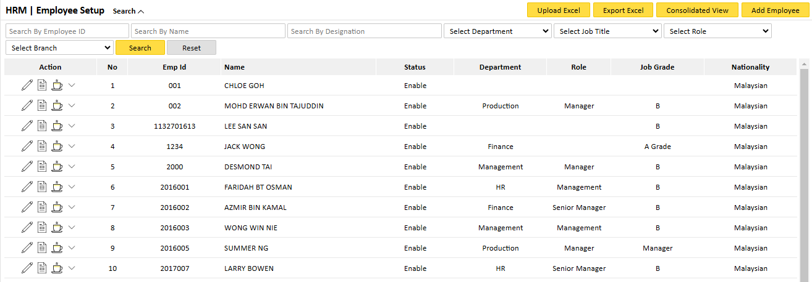
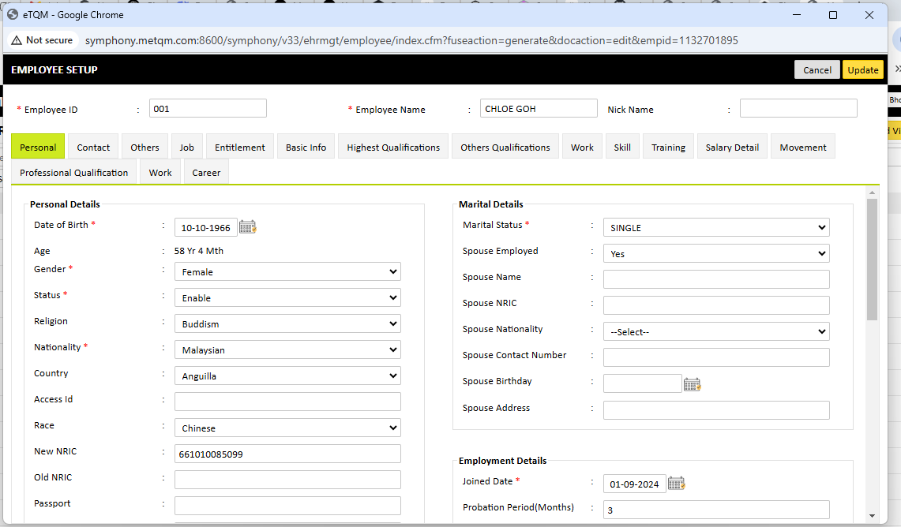

Adding employees is crucial for managing HR functions within Symphony eHRM.

### 2.1 Adding a New Employee

    1. Navigate to HR Module > Employee Setup.
    2. Click on Add Employee.
    3. Fill in the required employee details:

        * Employee ID 
        * Name
        * Date of Birth
        * Marital Status
        * Nationality 
        * Employment Details (Joined Date, Job Title, Department, etc.)  
        
    4. Click Save to register the employee in the system. 

