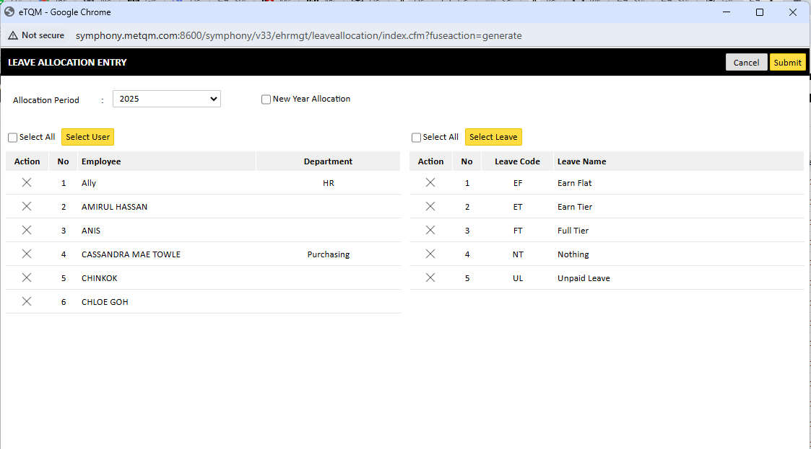
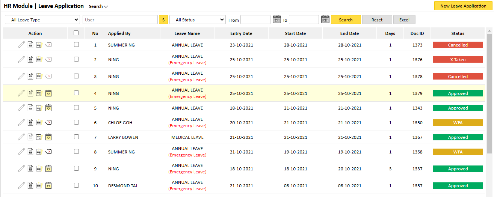
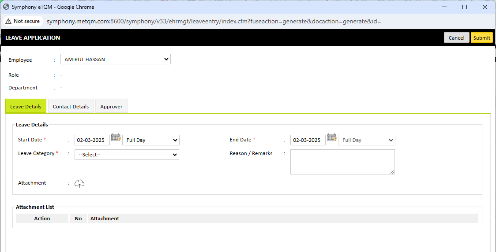

Employees can apply for leave through the system, and HR can track and approve leave applications.

### 3.1 Leave Allocation

Leave allocation is an essential step that must be performed for each leave period to assign leave entitlements to employees.  

To allocate leave:

    1. Navigate to HR Module > Leave Allocation.
    2. Select the leave period.
    3. Choose the employees to whom leave should be allocated.
    4. Select the leave type and enter the entitlement amount.
    5. Click Submit to finalize the leave allocation.

### 3.2 Applying for Leave

Employees can apply for leave through the system, and HR can track and approve leave applications.

#### 3.2.1 Applying for Leave

    1. Navigate to HR Module > Leave Application. 
    2. Click on New Leave Application.
    3. Select: 

        * Leave Type  
        * Start Date & End Date
        * Reason for Leave 
        
    4. Attach any supporting documents if required.
    5. Click Submit to apply for leave.

#### 3.2.2 Leave Approval Process

    1. HR/Admin can view leave requests under  INBOX > HR Module > Leave Application.  
    2. Click on a pending leave request 
    3. Review the details and either Approve or Reject the leave application. 
    4. The employee will receive a notification of the decision.  

