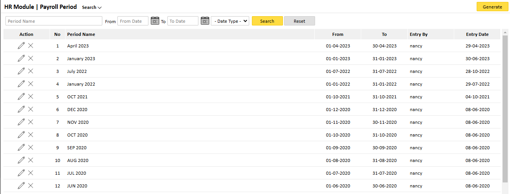
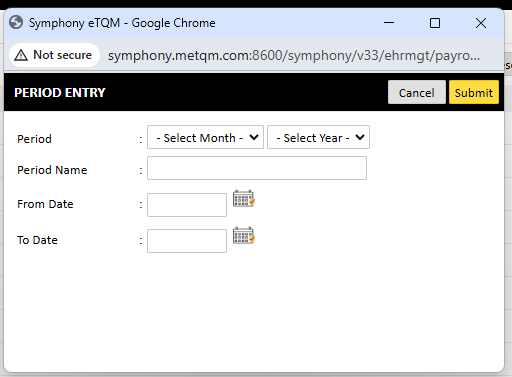
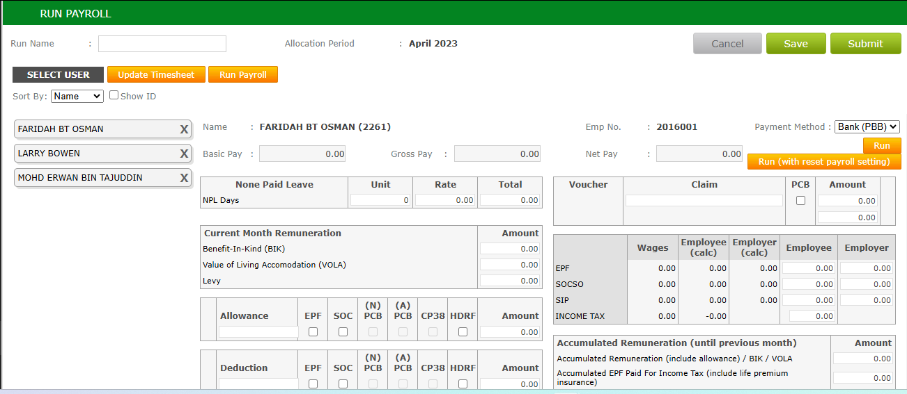

Payroll processing is essential for employee compensation.

### 4.1 Setting Up Payroll Periods

    1. Navigate to HR Module > Payroll Period. 
    2. Click on Create Payroll Period.
    3. Select: 

        * Period Name (e.g., January 2025)   
        * Start Date & End Date 
        
    4. Click Save to confirm the period setup.

### 4.2 Running Payroll

    1. Navigate to HR Module > Run Payroll. 
    2. Select the payroll period.
    3. Click Run Payroll to process salary payments.
    4. Review employee payroll details, including:  

        * Basic Pay    
        * Deductions (SOCSO, EPF, Tax, etc.)
        * Net Pay 
        
    5. Once reviewed, finalize payroll by clicking Confirm Payroll. 

### Conclusion

Symphony eHRM provides an efficient way to manage employees, leave applications, and payroll processing. By following this manual, HR teams can streamline their workflows and improve efficiency within their organizations.  

For further assistance, contact your system administrator or HR department.
